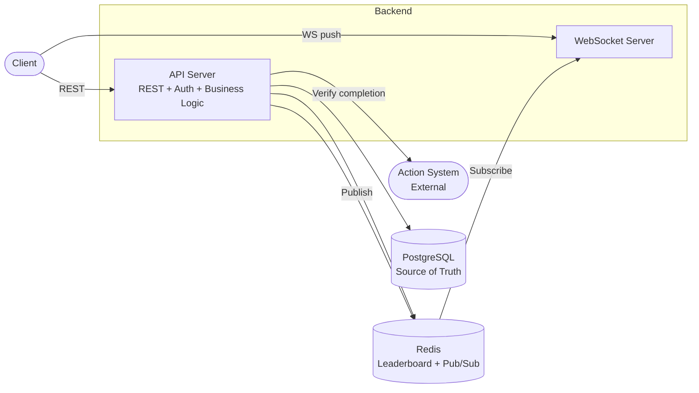
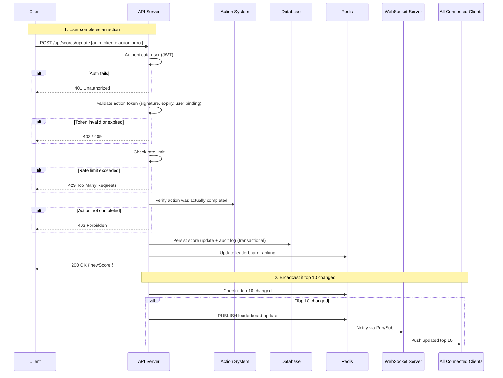

# Scoreboard Module — Specification

## Overview

A real-time scoreboard module for a backend API service. Users earn points by completing actions, and a live leaderboard displays the top rankings to all viewers. The system must prevent unauthorized score manipulation.

---

## Functional Requirements

1. Display a leaderboard showing the top 10 users by score (with pagination support for broader views)
2. Live-update the leaderboard to all connected viewers when rankings change
3. When a user completes an action, their score increases
4. Upon action completion, the client dispatches an API call to update the score
5. **Score update is a critical operation** — it must validate the request, verify the action was actually completed, and prevent fraud before awarding points. The full validation chain:
   - Authenticate the user (JWT)
   - Validate the action token (signature, expiry, user binding)
   - Verify action completion with the action system (server-side)
   - Check rate limits
   - Persist atomically (DB transaction)
   - Append to immutable audit log
6. Tiebreaker: when users have the same score, the user who reached that score first ranks higher
7. Score updates must be idempotent — retries return the original success response
8. Concurrent valid actions from the same user are processed independently

---

## Non-Functional Requirements

| Category | Requirement |
|----------|-------------|
| **Security** | Only authenticated, server-validated actions can increase scores. Action tokens are single-use, time-limited, and user-bound |
| **Fraud Prevention** | Server-side action verification before awarding score. Rate limiting for short-term abuse. Score velocity monitoring for long-term abuse |
| **Performance** | Leaderboard reads from Redis (~50k reads/sec). Score updates via DB transaction (~1k writes/sec) |
| **Reliability** | DB is source of truth. Graceful degradation when Redis or WebSocket fails. No silent data loss |
| **Auditability** | Append-only score audit log for every score change (`userId`, `actionId`, `pointsAwarded`, `scoreBefore`, `scoreAfter`, `timestamp`). Immutable — no updates, no deletes |
| **Real-time** | WebSocket push to all viewers when top 10 changes. Debounce rapid updates (e.g. 100ms window) |

---

## Tech Stack

| Technology | Purpose | Why |
|------------|---------|-----|
| **Node.js + Express** | API Server | Lightweight, handles async I/O well for WebSocket + REST |
| **PostgreSQL** | Primary database | Source of truth for users, scores, actions, audit log. ACID transactions for score updates |
| **Redis** | Leaderboard + Pub/Sub | Sorted set for O(log N) ranking. Pub/Sub for cross-instance WebSocket broadcast |
| **WebSocket (ws)** | Real-time push | Persistent connection for live leaderboard updates to all viewers |
| **JWT** | Authentication + action tokens | Stateless auth. Separate signing secrets for user identity and action proof |

---

## High-Level Design

### Component Diagram



| Component | Role |
|-----------|------|
| **API Server** | Handles authentication, validates score updates, serves leaderboard data |
| **WebSocket Server** | Maintains persistent connections with clients, pushes leaderboard changes in real time |
| **Action System** | External service that tracks action completion. API calls it to verify before awarding score |
| **Redis** | Sorted set for fast leaderboard ranking. Pub/Sub for broadcasting updates across server instances |
| **PostgreSQL** | Source of truth for user data, scores, and action audit log |

### Execution Flow



---

## API Specification

All errors return a consistent shape: `{ "error": "message" }`

### `POST /api/scores/update` (Critical Path)

*Requires authentication.*

This is the most critical endpoint in the module. It must validate, verify, and persist before awarding any points. A score should never be awarded without passing every layer of the validation chain described in Functional Requirements.

The server must verify the action is legitimate before awarding points. This involves two layers:

1. **Action token** — the server issues a signed, single-use token before the action starts. The client presents it upon completion. This prevents clients from fabricating score updates out of thin air.
2. **Server-side action validation** — before awarding the score, the API must verify with the action system (internal service) that the action was actually completed. A valid token alone is not sufficient — the server must confirm completion independently.

**Request:**
```json
{
  "actionToken": "<server-issued proof of action completion>"
}
```

**Responses:**

| Status | Condition |
|--------|-----------|
| `200` | Score updated — returns `{ userId, newScore }` |
| `400` | Missing or malformed request body |
| `401` | Not authenticated |
| `403` | Action token invalid, expired, or action not verified as completed |
| `409` | Action already claimed (prevents replay) |
| `429` | Rate limit exceeded |
| `500` | Internal error (DB or Redis failure) |

### `GET /api/leaderboard`

*Public — no authentication required.*

Returns users ranked by score with pagination support.

**Query Parameters:**

| Param | Type | Default | Description |
|-------|------|---------|-------------|
| `limit` | integer | `10` | Number of entries to return (max `100`) |
| `offset` | integer | `0` | Number of entries to skip |

**Response:** `200 OK`
```json
{
  "leaderboard": [
    { "rank": 1, "userId": 7, "name": "Alice", "score": 980 },
    { "rank": 2, "userId": 12, "name": "Bob", "score": 945 }
  ],
  "total": 1500,
  "limit": 10,
  "offset": 0,
  "updatedAt": "2026-02-26T12:00:00Z"
}
```

| Status | Condition |
|--------|-----------|
| `200` | Success |
| `400` | Invalid `limit` or `offset` (negative, non-integer, limit > 100) |
| `500` | Redis or DB unavailable |

### Real-Time Updates (WebSocket)

Clients connect to `ws://<host>/ws/leaderboard` (public, no auth required).

**Server pushes** a `leaderboard:updated` event whenever the top 10 changes:

```json
{
  "event": "leaderboard:updated",
  "data": {
    "leaderboard": [ ... ],
    "updatedAt": "2026-02-26T12:00:05Z"
  }
}
```

**Key behaviors:**
- Only broadcast when the top 10 actually changes (membership or ordering)
- **Debounce:** batch rapid updates into a single broadcast (e.g. 100ms window)
- Heartbeat ping/pong every 30s — disconnect stale clients
- The server must support clients reconnecting at any time. `GET /api/leaderboard` serves as the catch-up mechanism after a disconnection
- For multi-instance deployments, use Redis Pub/Sub so all instances broadcast consistently

### Security & Fraud Prevention

| Threat | Mitigation |
|--------|------------|
| Forged score updates | Server-issued action tokens — client cannot fabricate a valid proof |
| Token obtained without completing action | **Server-side action validation** — API verifies completion with the action system before awarding score |
| Replay attacks | Each action token is single-use; reuse returns `409` |
| Token theft | Token is bound to the authenticated user; mismatched userId is rejected |
| Spam / brute force | Per-user rate limiting (e.g. 10 updates/min) |
| Slow-burn abuse (under rate limit) | Score velocity monitoring — flag accounts with abnormally high long-term score rates for manual review |
| Expired actions | Action tokens have a short TTL (e.g. 5 minutes) |
| WebSocket flooding | Limit connections per IP |

---

## Scalability

### Single Instance Capacity

| Metric | Estimate |
|--------|----------|
| Concurrent WebSocket connections | ~10,000 (limited by OS file descriptors and memory) |
| Score updates/sec | ~1,000 (bottleneck: DB transactions) |
| Leaderboard reads/sec | ~50,000 (Redis sorted set is fast) |

Sufficient for most small-to-medium applications (< 10k concurrent users).

### Scaling Path

```
Single instance          → handles ~10k users, ~1k writes/sec
  ↓
+ Redis Pub/Sub          → multiple API instances share WebSocket broadcast
  ↓
+ DB read replicas       → offload leaderboard queries and user lookups
  ↓
+ Write batching         → buffer score updates, flush to DB in bulk (trades latency for throughput)
  ↓
+ Audit log partitioning → keep write performance stable as history grows
```

### Trade-offs

| Stage | Gains | Cost |
|-------|-------|------|
| Single instance | Simple to deploy and debug | Single point of failure |
| Redis Pub/Sub | Horizontal scaling for WebSocket | Added infrastructure; eventual consistency between instances |
| DB read replicas | Higher read throughput | Replication lag; read-after-write inconsistency |
| Write batching | 10x+ write throughput | Score updates are no longer instant (e.g. 500ms delay) |
| Audit log partitioning | Stable write perf over time | Migration complexity; cross-partition queries are slower |

---

## Reliability

### Failure Scenarios

| Component Down | Impact | Expected Behavior |
|----------------|--------|-------------------|
| **Redis** | Leaderboard reads fail | Score updates still persist to DB. API returns `503` for leaderboard. Reconciliation job resyncs Redis on recovery |
| **PostgreSQL** | Score updates fail | Leaderboard reads continue from Redis (stale but available). No data loss — updates are rejected, not dropped |
| **WebSocket Server** | Live updates stop | Leaderboard still available via `GET /api/leaderboard` (polling fallback) |
| **Redis Pub/Sub** | Cross-instance broadcast stops | Local instance still broadcasts to its own clients. Other instances serve stale data until recovery |
| **Action System** | Score verification fails | Score updates return `503`. No unverified scores are awarded |

### Design Principles

- **DB is source of truth** — Redis is a derived cache. Any drift is corrected by resyncing from DB
- **Graceful degradation** — lose Redis → lose live ranking but keep writes. Lose DB → lose writes but keep reads. Lose WebSocket → lose push but keep pull
- **No silent data loss** — score updates either fully succeed or fail with an error. Never acknowledge a score that wasn't persisted

---

## Monitoring & Observability

### Key Metrics

| Metric | Why |
|--------|-----|
| Score update latency (p50, p95, p99) | The critical path — detect DB or action system slowdowns early |
| Score update error rate by status code | Spike in 403s = potential attack. Spike in 500s = infrastructure issue |
| Action verification failure rate | High rate may indicate action system issues or fraud attempts |
| Redis ↔ DB score drift | Non-zero drift = reconciliation job is needed or failing |
| WebSocket active connections | Capacity planning — alerts before hitting connection limits |
| Leaderboard broadcast frequency | Unusual spikes may indicate debounce isn't working |
| Audit log write latency | Growing latency = table needs partitioning |

### Alerts

| Condition | Severity | Action |
|-----------|----------|--------|
| Score update error rate > 5% for 5 min | **High** | Investigate DB/Redis/action system health |
| Score update p99 latency > 2s | **Medium** | Check DB transaction performance |
| Redis ↔ DB score mismatch detected | **Medium** | Trigger reconciliation job |
| WebSocket connections > 80% of limit | **Medium** | Scale out or increase connection limit |
| Anomaly: user flagged for score velocity | **Low** | Queue for manual review |

### Logging

Score updates (the critical path) should log:
- `userId`, `actionId`, `result` (success/failure), `latency`, `errorCode` (if failed)
- Structured JSON format for easy querying
- **Do not log** action token contents (security-sensitive)

---

## Extendability

The current design should not prevent the following future requirements. The team should keep these in mind but **not** implement them now.

| Future Requirement | What to Keep Flexible |
|--------------------|----------------------|
| **Multiple leaderboards** (daily, weekly, all-time) | Leaderboard key should be parameterized, not hardcoded. e.g. `leaderboard:{scope}` in Redis. API accepts `?scope=weekly` |
| **Variable point values** (different actions worth different scores) | Action token should carry a `points` field signed by the server. Score update logic reads points from the token, not hardcoded `+1` |
| **Team / group leaderboards** | Leaderboard service should accept a generic "entity ID", not assume it's always a user |
| **Seasonal reset** | Leaderboard key includes a season identifier. Old seasons archived, not deleted. Audit log remains immutable across resets |
| **Custom tiebreakers** | Tiebreaker logic should be isolated (e.g. a comparator function), not embedded in query logic |
| **Webhooks / notifications** | Score update already triggers a broadcast. Webhook dispatch is a new subscriber to the same event |

### What This Means in Practice

The team should:
- **Parameterize** leaderboard identifiers rather than using a single global key
- **Read score values** from the action token rather than hardcoding
- **Keep the broadcast trigger generic** — "leaderboard changed" event, not "user X scored" event
- **Isolate tiebreaker logic** so it's swappable

---

## Configuration

| Variable | Description | Default |
|----------|-------------|---------|
| `AUTH_JWT_SECRET` | Secret for user authentication tokens | *required* |
| `ACTION_TOKEN_SECRET` | Separate secret for action tokens | *required* |
| `ACTION_TOKEN_TTL` | Action token expiry (seconds) | `300` |
| `RATE_LIMIT_MAX` | Max score updates per user per window | `10` |
| `RATE_LIMIT_WINDOW` | Rate limit window (seconds) | `60` |
| `REDIS_URL` | Redis connection string | `redis://localhost:6379` |
| `DATABASE_URL` | PostgreSQL connection string | *required* |
| `PORT` | HTTP server port | `3000` |

---

## What's Next

1. **Action cleanup job** — Scheduled task to expire unclaimed action tokens (`status = 'pending'` older than TTL). Prevents token hoarding and keeps the database clean.

2. **Admin review dashboard** — Internal tool for moderators to review anomaly-flagged accounts, inspect score audit logs, and take action (freeze, reset, ban).

3. **Redis ↔ DB reconciliation job** — Periodic background task to resync the Redis leaderboard from PostgreSQL, self-healing any drift from Redis failures or crashes.

4. **Load testing** — Validate the capacity estimates (~1k writes/sec, ~10k WebSocket connections) against the real system before launch. Load test the score update critical path end-to-end to find the actual bottleneck.

5. **Disaster recovery runbook** — Step-by-step procedures for the on-call team: how to trigger Redis ↔ DB reconciliation, how to verify Redis resynced correctly, how to audit score integrity, and how to recover from each failure scenario defined in the Reliability section.
